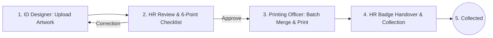

# Mengo Hospital HR ID Approval & Printing System

> **Enterprise Staff ID Card Lifecycle Management, Quality Verification, Vector PDF Batch Printing & Forensic Compliance Platform.**

[](https://www.php.net/)
[](https://www.sqlite.org/)
[-brightgreen.svg)](tests/run_all_tests.php)
[](docs/SECURITY.md)

---

## 🏥 About the System

The **Mengo Hospital ID Approval & Printing System** manages the entire lifecycle of hospital staff identification badges from initial artwork drafting to physical PVC printing and secure employee handover.



---

## ✨ Key Features

- **7-Stage Workflow State Machine**: `DRAFT` $\rightarrow$ `UPLOADED` $\rightarrow$ `PENDING_HR_APPROVAL` $\rightarrow$ `CORRECTION_REQUESTED` $\rightarrow$ `APPROVED` $\rightarrow$ `PRINTED` $\rightarrow$ `COLLECTED`.
- **Atomic Compare-And-Swap (CAS)**: Prevents multi-HR approval collision and duplicate card printing.
- **High-Fidelity Batch PDF Engine**: Merges 10–100+ approved cards into multi-page print documents while preserving 100% vector sharpness and dimensions for thermal PVC badge printers.
- **SHA-256 Cryptographic Integrity**: Three-phase tamper-detection verifying PDF byte integrity at upload, approval, and physical printing.
- **Immutable Audit Trail**: Captures staff ID, action, state delta, timestamp, IP address, and User-Agent for every operation.
- **Real-Time Live Sync**: Polling API (`/api/sync`) for instant unread badge counts, overdue approval indicators, and printing queue notifications.
- **Hot Database Backups**: Zero-downtime online SQLite backup API with administrative web download.
- **Live Health Diagnostics**: `/health` endpoint executing real operational probes against database, storage, clock, and PDF engines.

---

## 🚀 Quick Start (Local Development)

### 1. Requirements
- PHP 8.0 or newer with `pdo_sqlite`, `fileinfo`, `mbstring`, and `openssl` extensions.

### 2. Setup
```bash
# Clone or enter directory
cd "E:\ID APPROVAL SYSTEM"

# Copy environment file
cp .env.example .env

# Run database migrations
php -r "require 'src/autoload.php'; \$m = new Mengo\IdApproval\Database\Migrator(); print_r(\$m->run());"

# Run automated test suite
php tests/run_all_tests.php
```

### 3. Start Development Server
```bash
php -S 127.0.0.1:8000 -t public
```
Visit `http://127.0.0.1:8000` in your web browser.

---

## 👥 Default Seeded Accounts (Development Mode)

| Role | Username | Email | Default Password |
| :--- | :--- | :--- | :--- |
| **System Administrator** | `admin` | `admin@mengohospital.org` | `MengoAdmin2026!` |
| **ID Designer** | `designer` | `designer@mengohospital.org` | `MengoDesigner2026!` |
| **HR Manager 1** | `sarah.namukasa` | `sarah.namukasa@mengohospital.org` | `MengoHR2026!` |
| **HR Manager 2** | `david.kato` | `david.kato@mengohospital.org` | `MengoHR2026!` |
| **Printing Officer** | `peter.okello` | `printing@mengohospital.org` | `MengoPrint2026!` |

*(Note: Change all default passwords before deploying to online production environments).*

---

## 📖 Comprehensive Documentation

Complete institutional documentation is located in the **[`docs/`](docs/)** directory:

- 🏗️ **[System Architecture](docs/SYSTEM_ARCHITECTURE.md)** — Architectural design and layer breakdown.
- 💾 **[Database Architecture](docs/DATABASE.md)** — Schema specifications, constraints, and relational diagrams.
- 🔒 **[Security Architecture](docs/SECURITY.md)** — Encryption, CSRF, XSS, and storage isolation.
- 👤 **[Authentication & RBAC](docs/AUTHENTICATION_AND_RBAC.md)** — Role permissions matrix and session lifecycle.
- 🔄 **[Workflow State Machine](docs/WORKFLOW.md)** — State machine and CAS concurrency control.
- 🖨️ **[PDF & Printing Engine](docs/PDF_AND_PRINTING.md)** — Vector PDF handling and batch merge engine.
- 🔔 **[Notifications System](docs/NOTIFICATIONS.md)** — In-app alerts, email notifications, and live sync.
- 📜 **[Audit Logging](docs/AUDIT_LOGGING.md)** — Forensic compliance event logging.
- 🌐 **[API Reference](docs/API.md)** — Live sync and batch validation endpoints.
- 🧪 **[Testing Manual](docs/TESTING.md)** — Test runner execution and coverage details.
- 🚀 **[Production Deployment](docs/DEPLOYMENT.md)** — Nginx / Apache web server configuration and SSL hardening.
- 💾 **[Backup & Recovery](docs/BACKUP_AND_RECOVERY.md)** — Zero-downtime online backup procedures.
- 🩺 **[Monitoring & Health](docs/MONITORING.md)** — Diagnostic monitor and logging.
- 🛠️ **[Troubleshooting Guide](docs/TROUBLESHOOTING.md)** — Historical error resolutions and debugging.
- 🔧 **[Maintenance Guide](docs/MAINTENANCE.md)** — User provisioning and operational routines.
- 📝 **[Changelog](docs/CHANGELOG.md)** — Full version history.
- 🚨 **[Disaster Recovery Plan](docs/DISASTER_RECOVERY.md)** — Emergency restoration playbooks.
"# ID-APPROVAL-SYSTEM" 
