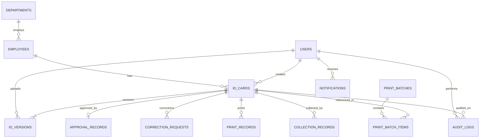

# Database Architecture & Schema Specification

## 1. Engine & Storage Configuration

The database layer utilizes **SQLite 3** operating with enterprise reliability settings configured on every PDO connection via `src/Support/Database.php`:

```sql
PRAGMA journal_mode = WAL;          -- Write-Ahead Logging for high concurrency
PRAGMA synchronous = NORMAL;        -- Balances durability with write throughput
PRAGMA foreign_keys = ON;           -- Enforces strict relational foreign key constraints
PRAGMA busy_timeout = 5000;         -- 5-second wait before throwing database locked exception
PRAGMA cache_size = -64000;         -- 64MB memory cache for rapid index scanning
```

---

## 2. Relational Entity Diagram



---

## 3. Schema & Tables Reference

### 3.1 `users`
Stores system user accounts for authentication and RBAC.

| Column | Type | Constraints | Description |
| :--- | :--- | :--- | :--- |
| `id` | `INTEGER` | `PRIMARY KEY AUTOINCREMENT` | Unique internal user ID. |
| `staff_id` | `VARCHAR(50)` | `UNIQUE NOT NULL` | Mengo Hospital staff payroll/employee number. |
| `username` | `VARCHAR(100)`| `UNIQUE NOT NULL` | Unique login username (case-insensitive in app layer). |
| `name` | `VARCHAR(150)`| `NOT NULL` | Full display name of the staff member. |
| `email` | `VARCHAR(150)`| `UNIQUE NOT NULL` | Official email address (enforced lowercase). |
| `password_hash`| `VARCHAR(255)`| `NOT NULL` | Argon2id / Bcrypt salted password hash. |
| `role` | `VARCHAR(50)` | `NOT NULL CHECK(role IN ('DESIGNER', 'HR_MANAGER', 'PRINTING_OFFICER', 'ADMINISTRATOR'))` | System role. |
| `department` | `VARCHAR(100)`| `DEFAULT 'Administration'` | Department assignment. |
| `status` | `VARCHAR(20)` | `DEFAULT 'ACTIVE' CHECK(status IN ('ACTIVE', 'INACTIVE', 'SUSPENDED'))` | Account status. |
| `force_password_change` | `INTEGER` | `DEFAULT 0` | 1 if user must reset password on next login. |
| `last_login_at` | `DATETIME` | `NULL` | Timestamp of most recent successful authentication. |

### 3.2 `departments`
Hospital departmental directory.

| Column | Type | Constraints | Description |
| :--- | :--- | :--- | :--- |
| `id` | `INTEGER` | `PRIMARY KEY AUTOINCREMENT` | Department ID. |
| `code` | `VARCHAR(20)` | `UNIQUE NOT NULL` | Short code (e.g. `MED`, `NURS`, `ADMIN`). |
| `name` | `VARCHAR(100)`| `NOT NULL` | Full department name. |

### 3.3 `employees`
Mengo Hospital staff members for whom ID cards are designed and issued.

| Column | Type | Constraints | Description |
| :--- | :--- | :--- | :--- |
| `id` | `INTEGER` | `PRIMARY KEY AUTOINCREMENT` | Employee internal ID. |
| `staff_id` | `VARCHAR(50)` | `UNIQUE NOT NULL` | Unique staff payroll number. |
| `full_name` | `VARCHAR(150)`| `NOT NULL` | Official employee name as it appears on badge. |
| `department_id` | `INTEGER` | `NOT NULL REFERENCES departments(id)` | Foreign key to department. |
| `designation` | `VARCHAR(100)`| `NOT NULL` | Official job title. |
| `blood_group` | `VARCHAR(10)` | `NULL` | Emergency blood group (e.g., `O+`, `A-`). |
| `national_id` | `VARCHAR(50)` | `NULL` | Uganda National Identification Number (NIN). |
| `status` | `VARCHAR(20)` | `DEFAULT 'ACTIVE'` | Employment status (`ACTIVE`, `INACTIVE`, `TERMINATED`). |

### 3.4 `id_cards`
Root record tracking the lifecycle of an ID card instance.

| Column | Type | Constraints | Description |
| :--- | :--- | :--- | :--- |
| `id` | `INTEGER` | `PRIMARY KEY AUTOINCREMENT` | ID Card record ID. |
| `card_reference` | `VARCHAR(60)` | `UNIQUE NOT NULL` | Formal hospital reference (e.g., `MH-ID-2026-00042`). |
| `employee_id` | `INTEGER` | `NOT NULL REFERENCES employees(id)` | Associated employee. |
| `current_status`| `VARCHAR(40)` | `NOT NULL CHECK(current_status IN ('DRAFT', 'UPLOADED', 'PENDING_HR_APPROVAL', 'CORRECTION_REQUESTED', 'APPROVED', 'PRINTED', 'COLLECTED', 'IMPORT_REVIEW_REQUIRED'))` | Current lifecycle state. |
| `current_version_number` | `INTEGER` | `DEFAULT 1` | Latest version number uploaded. |
| `approved_version_id` | `INTEGER` | `NULL REFERENCES id_versions(id)` | Specific version approved for printing. |
| `created_by_user_id` | `INTEGER` | `NOT NULL REFERENCES users(id)` | Designer who created the card. |
| `assigned_designer_id`| `INTEGER` | `NULL REFERENCES users(id)` | Assigned designer for corrections. |

### 3.5 `id_versions`
Immutable log of every PDF version uploaded for an ID card.

| Column | Type | Constraints | Description |
| :--- | :--- | :--- | :--- |
| `id` | `INTEGER` | `PRIMARY KEY AUTOINCREMENT` | Version ID. |
| `id_card_id` | `INTEGER` | `NOT NULL REFERENCES id_cards(id) ON DELETE CASCADE` | Associated card. |
| `version_number` | `INTEGER` | `NOT NULL` | Incremental version index (v1, v2...). |
| `file_path` | `VARCHAR(255)`| `NOT NULL` | Relative path in protected storage. |
| `file_sha256` | `VARCHAR(64)` | `NOT NULL` | Cryptographic SHA-256 integrity hash. |
| `uploaded_by_user_id` | `INTEGER` | `NOT NULL REFERENCES users(id)` | Uploader ID. |
| `is_approved` | `INTEGER` | `DEFAULT 0` | 1 if this specific version received HR approval. |

### 3.6 `approval_records`
Formal HR approval sign-off with multi-point verification checklist.

| Column | Type | Constraints | Description |
| :--- | :--- | :--- | :--- |
| `id` | `INTEGER` | `PRIMARY KEY AUTOINCREMENT` | Approval record ID. |
| `id_card_id` | `INTEGER` | `UNIQUE NOT NULL REFERENCES id_cards(id) ON DELETE CASCADE` | Approved card. |
| `version_id` | `INTEGER` | `NOT NULL REFERENCES id_versions(id)` | Specific version signed off. |
| `hr_user_id` | `INTEGER` | `NOT NULL REFERENCES users(id)` | HR Manager who approved. |
| `hr_name` | `VARCHAR(150)`| `NOT NULL` | Approver name snapshot. |
| `checklist_photo` | `INTEGER` | `NOT NULL DEFAULT 1` | 1 if photo meets hospital standard. |
| `checklist_name` | `INTEGER` | `NOT NULL DEFAULT 1` | 1 if spelling and naming verified. |
| `checklist_staff_no` | `INTEGER` | `NOT NULL DEFAULT 1` | 1 if staff ID matches HR records. |
| `checklist_department`| `INTEGER` | `NOT NULL DEFAULT 1` | 1 if department verified. |
| `checklist_designation`| `INTEGER` | `NOT NULL DEFAULT 1` | 1 if title verified. |
| `checklist_layout` | `INTEGER` | `NOT NULL DEFAULT 1` | 1 if bleeding and margins verified. |
| `file_sha256_at_approval` | `VARCHAR(64)` | `NOT NULL` | SHA-256 at moment of approval. |
| `approved_at` | `DATETIME` | `NOT NULL` | Timestamp of approval. |

### 3.7 `print_batches` & `print_batch_items`
Manages bulk batch printing jobs and individual card items included in merged PDF output.

---

## 4. Migration Path to MySQL / PostgreSQL

If hospital staff volume scales to hundreds of concurrent operators, the repository pattern allows straightforward migration:

1. **Database Connection (`src/Support/Database.php`)**: Replace SQLite PDO DSN with MySQL (`mysql:host=...;dbname=...;charset=utf8mb4`) or PostgreSQL (`pgsql:host=...;dbname=...`).
2. **Schema Types**: Convert `INTEGER PRIMARY KEY AUTOINCREMENT` to `INT AUTO_INCREMENT PRIMARY KEY` (MySQL) or `SERIAL PRIMARY KEY` (PostgreSQL).
3. **Prepared Statements**: All queries in `src/Repositories/` already use standard ANSI SQL with named parameters (`:param`), requiring zero query syntax changes.
