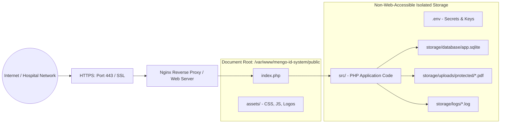

# Production Deployment & Web Server Hardening

## 1. Production Architecture Overview

In a production deployment, only the `public/` directory must be exposed to the internet. All core source code (`src/`), storage (`storage/`), database (`storage/database/`), and configuration (`.env`) reside strictly outside the web server document root.



---

## 2. Web Server Configuration

### 2.1 Nginx + PHP-FPM Configuration (Recommended)

Save as `/etc/nginx/sites-available/mengo-id-system.conf`:

```nginx
server {
    listen 80;
    server_name id.mengohospital.org;
    return 301 https://$host$request_uri;
}

server {
    listen 443 ssl http2;
    server_name id.mengohospital.org;

    ssl_certificate /etc/ssl/certs/mengohospital.crt;
    ssl_certificate_key /etc/ssl/private/mengohospital.key;
    ssl_protocols TLSv1.2 TLSv1.3;
    ssl_ciphers HIGH:!aNULL:!MD5;

    # Document Root (Strictly pointed to public)
    root /var/www/mengo-id-system/public;
    index index.php;

    client_max_body_size 35M;

    # Security Headers
    add_header X-Content-Type-Options "nosniff" always;
    add_header X-Frame-Options "SAMEORIGIN" always;
    add_header X-XSS-Protection "1; mode=block" always;
    add_header Referrer-Policy "strict-origin-when-cross-origin" always;

    # Deny access to hidden files (.env, .git)
    location ~ /\.(?!well-known) {
        deny all;
    }

    # Static assets caching
    location /assets/ {
        expires 30d;
        add_header Cache-Control "public, no-transform";
    }

    # Application routing
    location / {
        try_files $uri $uri/ /index.php?$query_string;
    }

    # PHP-FPM FastCGI
    location ~ \.php$ {
        include fastcgi_params;
        fastcgi_pass unix:/var/run/php/php8.2-fpm.sock;
        fastcgi_param SCRIPT_FILENAME $realpath_root$fastcgi_script_name;
        fastcgi_param DOCUMENT_ROOT $realpath_root;
        fastcgi_param HTTP_PROXY "";
        fastcgi_buffers 16 16k;
        fastcgi_buffer_size 32k;
    }
}
```

---

### 2.2 Apache 2.4+ VirtualHost Configuration

Save as `/etc/apache2/sites-available/mengo-id-system.conf`:

```apache
<VirtualHost *:80>
    ServerName id.mengohospital.org
    Redirect permanent / https://id.mengohospital.org/
</VirtualHost>

<VirtualHost *:443>
    ServerName id.mengohospital.org
    DocumentRoot /var/www/mengo-id-system/public

    SSLEngine on
    SSLCertificateFile /etc/ssl/certs/mengohospital.crt
    SSLCertificateKeyFile /etc/ssl/private/mengohospital.key

    <Directory /var/www/mengo-id-system/public>
        Options -Indexes +FollowSymLinks
        AllowOverride All
        Require all granted
    </Directory>

    # Block access to storage, src, and configuration
    <DirectoryMatch "^/var/www/mengo-id-system/(src|storage|database|docs|tests)">
        Require all denied
    </DirectoryMatch>

    ErrorLog ${APACHE_LOG_DIR}/mengo_id_error.log
    CustomLog ${APACHE_LOG_DIR}/mengo_id_access.log combined
</VirtualHost>
```

---

## 3. Production Deployment Checklist

1. [ ] Point web server document root strictly to `/var/www/mengo-id-system/public`.
2. [ ] Verify `.env` has `APP_ENV=production` and `APP_DEBUG=false`.
3. [ ] Set `APP_URL=https://id.mengohospital.org`.
4. [ ] Ensure file permissions: `storage/` writable by web server user (`www-data`).
5. [ ] Run `php tests/run_all_tests.php` to verify all 74 tests pass.
6. [ ] Confirm HTTPS certificate is active and redirecting HTTP traffic.
