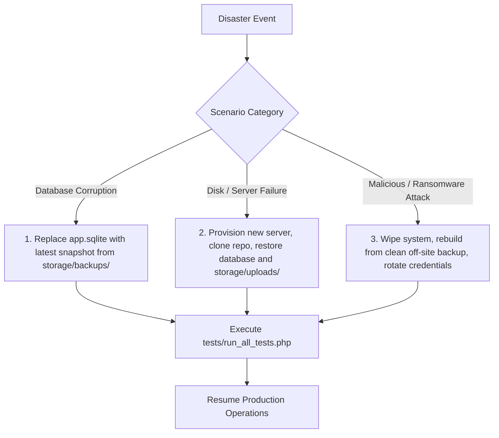

# Disaster Recovery Plan & Business Continuity

## 1. Objectives & RPO / RTO Targets

| Metric | Target | Description |
| :--- | :--- | :--- |
| **Recovery Point Objective (RPO)** | $\le 24 \text{ Hours}$ | Maximum acceptable data loss window (backed up daily at midnight). |
| **Recovery Time Objective (RTO)** | $\le 30 \text{ Minutes}$ | Maximum duration to restore complete system operations from backup. |

---

## 2. Threat Scenarios & Restoration Playbooks



### Scenario A: Database Corruption (SQLite File Malfunction)
1. **Diagnosis**: `/health` reports `SQLite Database Integrity: error` or PRAGMA returns corrupted b-tree.
2. **Action**:
   ```bash
   # Stop server
   sudo systemctl stop nginx php8.2-fpm
   
   # Backup corrupted file for forensic review
   mv storage/database/app.sqlite storage/database/corrupted_$(date +%s).sqlite
   
   # Restore latest valid backup
   LATEST_BACKUP=$(ls -t storage/backups/*.sqlite | head -n 1)
   cp "$LATEST_BACKUP" storage/database/app.sqlite
   
   # Set permissions
   sudo chown www-data:www-data storage/database/app.sqlite
   sudo chmod 664 storage/database/app.sqlite
   
   # Start server and verify
   sudo systemctl start nginx php8.2-fpm
   php tests/run_all_tests.php
   ```

---

### Scenario B: Complete Server Hardware Failure
1. Provision a fresh Linux instance (Ubuntu 22.04 / 24.04).
2. Install PHP 8.2 with `pdo_sqlite`, `fileinfo`, `mbstring`, `openssl`, and Nginx.
3. Clone repository and copy `.env` from secure offsite secret storage.
4. Restore `storage/database/app.sqlite` and `storage/uploads/protected/` from offsite backup repository.
5. Apply directory permissions: `chown -R www-data:www-data storage/`.
6. Run `php tests/run_all_tests.php` to confirm 100% test pass.
7. Switch DNS A-record to the new server IP.
