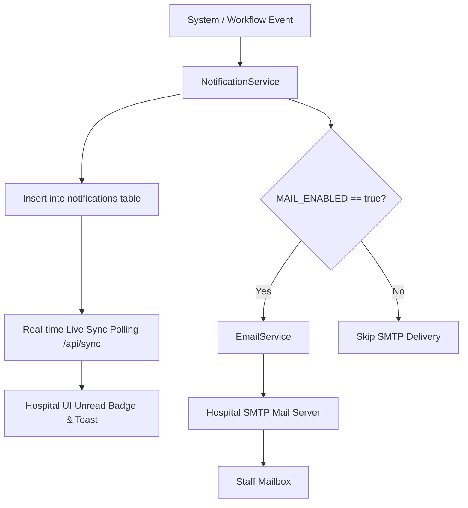

# Notifications System Specification

## 1. Notification Architecture

The application implements a dual-channel notification pipeline consisting of **In-App Database Alerts** (primary channel) and **Transactional Email Delivery** (optional secondary channel).

---

## 2. Notification Matrix by Event

| Lifecycle Event | Recipient Target | In-App Alert | Email Notification | Action Link |
| :--- | :--- | :---: | :---: | :--- |
| **New ID Uploaded** | All `HR_MANAGER` users | ✅ | Optional | `/hr/pending` |
| **Correction Requested** | Assigned `DESIGNER` | ✅ | Optional | `/designer/corrections` |
| **ID Approved** | Assigned `DESIGNER` + `PRINTING_OFFICER` | ✅ | Optional | `/printing/ready` |
| **ID Printed** | All `HR_MANAGER` users | ✅ | Optional | `/hr/collection` |
| **ID Collected** | Assigned `DESIGNER` | ✅ | Optional | `/id-cards/{id}` |
| **Password Reset by Admin** | Affected User | ✅ | Optional | `/login` |

---

## 3. Real-Time Sync Engine (`/api/sync`)

Client interfaces poll the `/api/sync` endpoint periodically (every 10–30 seconds). The endpoint returns lightweight JSON containing:
- Count of unread notifications for the active user.
- Queue counts for the user's role (e.g. pending approvals for HR, ready to print for Printing Officers).
- Smart follow-up indicators for stale records exceeding attention thresholds.
