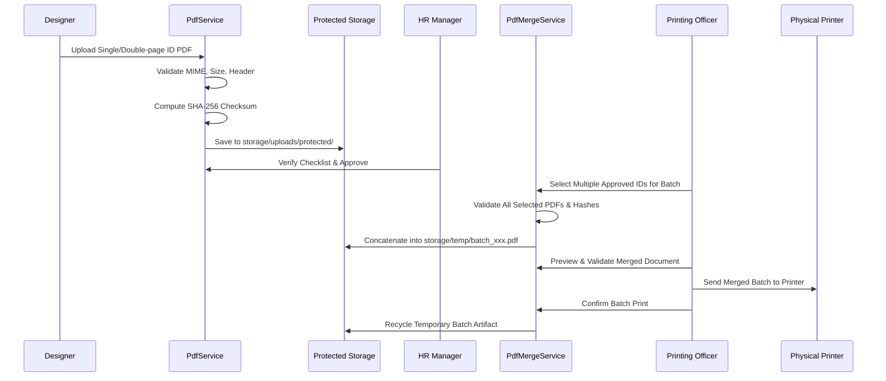

# PDF Processing & Batch Printing Engine

## 1. High-Fidelity PDF Processing

The ID printing pipeline preserves native vector clarity, bleed dimensions, color spaces (CMYK/RGB), and hospital fonts. The engine avoids raster downsampling to ensure that printed plastic PVC cards remain sharp and readable by optical badge scanners.

---

## 2. PDF Lifecycle Pipeline

---

## 3. Batch Merge Engine (`PdfMergeService`)

The batch printing system allows Printing Officers to select 10, 50, or 100+ approved cards and concatenate them into a single consolidated multi-page PDF document.

### Features
1. **Pre-flight Integrity Check**: Every selected PDF is verified against its approved SHA-256 hash before entering the merge pipeline.
2. **Partial Batch Resilience**: If one file in a selection of 50 is corrupted or missing, the system reports the exact failure and allows printing the 49 valid cards without aborting the entire batch.
3. **Sequential Page Preservation**: Cards are merged in explicit sequence, maintaining exact front-and-back alignment for double-sided thermal card printers.
4. **Automatic Garbage Collection**: Temporary merged batch PDFs stored under `storage/temp/` are purged immediately upon print confirmation or via the automated cleanup worker.
