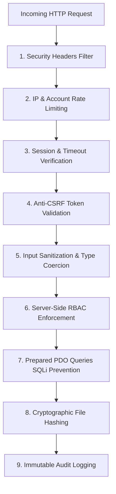

# Security Architecture & Hardening

## 1. Security Principles & Threat Model

The application protects hospital identity data, prevents unauthorized ID card approvals, and ensures the integrity of printed identification badges against forgery and tampering.

---

## 2. Core Security Controls

### 2.1 Password Security & Storage
- **Algorithm**: Passwords are saved using standard salted hashes (`PASSWORD_DEFAULT` utilizing Bcrypt or Argon2id).
- **Enforcement**: Plaintext passwords are never stored in the database, never echoed in views, and strictly excluded from logs and audit records.
- **First Login**: New user accounts created with initial temporary passwords have `force_password_change = 1`. Any attempt to access system features redirects directly to `/change-password`.

### 2.2 Cross-Site Request Forgery (CSRF) Prevention
- All state-mutating POST requests require a valid cryptographic token (`_csrf_token`).
- Tokens are generated using `random_bytes(32)` via `src/Security/CsrfToken.php` and bound to the active session.
- Token validation is enforced automatically by `CsrfMiddleware::verify($request)` prior to invoking controller actions.

### 2.3 SQL Injection Defense
- Zero string-concatenated SQL queries exist in the application.
- 100% of database interactions occur through PDO prepared statements with strict parameter type binding (`PDO::PARAM_INT`, `PDO::PARAM_STR`).

### 2.4 Cross-Site Scripting (XSS) Prevention
- Output rendered in views is escaped using `htmlspecialchars($val, ENT_QUOTES | ENT_SUBSTITUTE, 'UTF-8')`.
- HTML tags in user-submitted notes or text fields are sanitized via `src/Security/Sanitizer.php`.

### 2.5 Brute-Force Protection & Rate Limiting
- `src/Security/RateLimiter.php` monitors failed authentication attempts by IP address and username.
- Exceeding 5 failed attempts locks the login endpoint for 15 minutes.

### 2.6 Session Security & Session Fixation Defense
- `SessionManager::start()` configures secure cookie attributes:
  - `cookie_httponly = true` (prevents JavaScript access to session cookie).
  - `cookie_samesite = 'Lax'` (defends against cross-site timing attacks).
  - `cookie_secure = true` (when running under HTTPS).
- Upon successful credential verification, `SessionManager::regenerate()` issues a new session ID to eliminate session fixation vulnerabilities.

### 2.7 Protected Storage Isolation
- Uploaded and approved ID card PDFs are stored under `storage/uploads/protected/`, outside the public document root.
- Direct web access to the `storage/` directory is blocked at the web server layer.
- Files are served exclusively through the authenticated controller (`/id-cards/{id}/pdf`), which validates the user's active session and role permissions before streaming bytes.

### 2.8 SHA-256 Checksum Validation
- When an ID PDF is uploaded, its SHA-256 cryptographic hash is calculated and stored in `id_versions.file_sha256`.
- When an HR Manager approves the card, the hash is re-verified to guarantee the approved file is byte-for-byte identical to the uploader's version.
- When the Printing Officer sends the card to the printer, the hash is validated a third time to ensure zero tampering occurred on disk between approval and physical printing.
