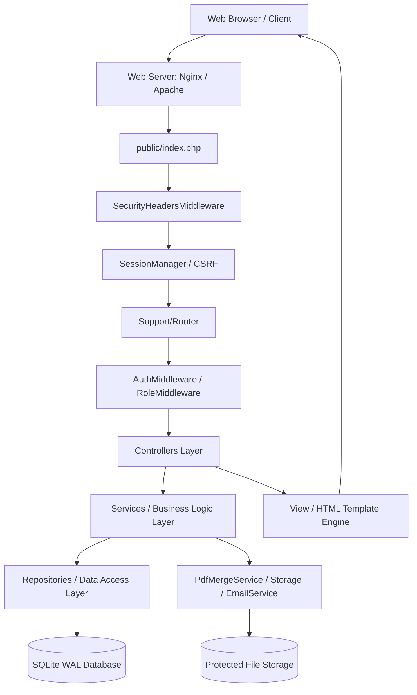

# System Architecture Documentation

## 1. Architectural Philosophy

The **Mengo Hospital ID Approval & Printing System** is engineered using clean, modular, layered architecture principles in pure PHP 8.0+. It eliminates heavy third-party framework overhead, ensuring extreme runtime speed, predictable execution paths, zero framework bloat, and straightforward institutional maintainability.

---

## 2. Layer Responsibilities

The application enforces a strict separation of concerns across 7 distinct architectural tiers:

### Tier 1: Entry & Global Middleware (`public/index.php`)
- Initializes timezone (`Africa/Kampala` / UTC+3).
- Applies security response headers (`X-Content-Type-Options`, `X-Frame-Options`, `Referrer-Policy`, CSP).
- Starts secure session with strict cookie parameters (`HttpOnly`, `SameSite=Lax`).
- Registers uncaught exception and error handlers that log technical stack traces to `storage/logs/app.log` while rendering friendly error pages to end users.

### Tier 2: Routing & HTTP Dispatch (`src/Support/Router.php`, `src/Support/Request.php`, `src/Support/Response.php`)
- Parses incoming HTTP method and URI paths.
- Matches static and parameterized route patterns (`/id-cards/{id}`, `/printing/batches/{id}/preview`).
- Intercepts 404 (Not Found) and 403 (Forbidden) exceptions and maps them to appropriate error views.

### Tier 3: Authentication & Role-Based Middleware (`src/Middleware/`)
- `AuthMiddleware`: Verifies active session presence and redirects unauthenticated requests to `/login`.
- `RoleMiddleware`: Enforces server-side role boundaries (`DESIGNER`, `HR_MANAGER`, `PRINTING_OFFICER`, `ADMINISTRATOR`).
- `CsrfMiddleware`: Intercepts state-mutating POST requests and verifies CSRF token validity.

### Tier 4: Controllers (`src/Controllers/`)
- **Single Responsibility**: Process incoming HTTP requests, extract and sanitize input parameters, invoke domain services, and return responses or render views.
- **Rule**: Controllers contain *no SQL queries* and *no direct business workflow rules*.

| Controller | Primary Purpose |
| :--- | :--- |
| `AuthController` | Login authentication, logout, first-login password enforcement. |
| `DesignerController` | ID card drafting, initial PDF upload, correction queue review, PDF re-upload. |
| `HrController` | Pending approval queue, checklist validation, ID approval, correction requests, badge handover/collection. |
| `PrintingController` | Ready-to-print queue, batch merging, print manifest generation, print confirmation. |
| `AdminController` | User provisioning, role assignment, password reset, account status toggles. |
| `ReportController` | Metrics aggregation, operational reports, CSV data export. |
| `AuditLogController` | Full compliance audit trail browsing, filtering by action/date/user. |
| `BackupController` | Hot SQLite database backup generation and secure administrative download. |
| `HealthController` | Operational verification of runtime, database, storage, clock, and PDF engine. |
| `SyncController` | Lightweight JSON polling endpoint for live unread counts and queue state. |

### Tier 5: Domain Services (`src/Services/`)
- **Single Responsibility**: Enforce all hospital business rules, state transition invariants, transactional boundaries, and external integrations.

| Service | Responsibility |
| :--- | :--- |
| `WorkflowService` | Manages the 7-state ID card lifecycle, version increments, approval checks, and CAS concurrency control. |
| `PdfService` | Validates uploaded PDFs (MIME, size, structure), extracts metadata, calculates SHA-256 hashes, stores files in protected directories. |
| `PdfMergeService` | Concatenates multiple single/double-page employee ID PDFs into a single batch print document while maintaining vector quality. |
| `AuditService` | Formats and commits immutable audit log records for every security and workflow transition. |
| `NotificationService`| Dispatches targeted in-app alerts to users or roles (e.g. notifying all HR managers on new uploads). |
| `EmailService` | Renders hospital-branded HTML email templates and sends asynchronous notification emails if SMTP is enabled. |
| `BackupService` | Executes SQLite online backup API calls to produce consistent snapshots without locking active transactions. |
| `ReportService` | Computes turnaround times, status counts, and department-level approval metrics. |
| `AuthService` | Verifies user credentials, handles login throttling/lockout, updates last login timestamps. |

### Tier 6: Repositories & Data Access (`src/Repositories/`)
- **Single Responsibility**: Execute parameterized PDO statements against the database.
- **Rule**: All SQL is isolated inside repositories. Prepared statements with strict parameter binding are mandatory.

| Repository | Managed Entity |
| :--- | :--- |
| `UserRepository` | User accounts, credentials, role queries, email/username uniqueness checks. |
| `EmployeeRepository` | Mengo Hospital staff profiles (Staff ID, designation, department). |
| `IdCardRepository` | Root ID card records, card references, active lifecycle status. |
| `IdVersionRepository` | Immutable version records (v1, v2...), file paths, SHA-256 hashes. |
| `ApprovalRecordRepository` | Formal HR sign-offs, 6-point checklist states, approver metadata. |
| `CorrectionRequestRepository`| HR feedback notes, return reasons, resolution tracking. |
| `PrintRecordRepository` | Individual print logging, timestamping, and version tracking. |
| `PrintBatchRepository` | Bulk print batches, batch manifests, page counts, output file metadata. |
| `NotificationRepository` | In-app alerts, read/unread states, recipient links. |
| `AuditLogRepository` | Immutable compliance audit records with IP and User-Agent tracking. |

### Tier 7: Persistence & Storage (`storage/`, `database/`)
- `storage/database/app.sqlite`: Primary SQLite relational database running in Write-Ahead Logging (WAL) mode.
- `storage/uploads/protected/`: Secure non-web-accessible directory holding original and versioned employee ID PDFs.
- `storage/temp/`: Isolated workspace for temporary batch-merged PDF print jobs.
- `storage/backups/`: Dedicated archive directory for timestamped SQLite database backups.
- `storage/logs/`: Structured application, security, and email logs.
