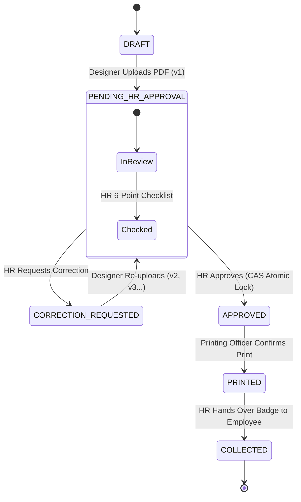

# ID Card Lifecycle & Workflow State Machine

## 1. Complete Lifecycle State Machine

The identification card lifecycle consists of 7 strictly sequenced states defined in `Mengo\IdApproval\Models\IdStatus`:



---

## 2. State Invariants & Role Transitions

| State | Description | Who Can Trigger Next Step? | Target State |
| :--- | :--- | :--- | :--- |
| **`DRAFT`** | Initial placeholder before artwork upload. | Designer | `PENDING_HR_APPROVAL` |
| **`PENDING_HR_APPROVAL`** | Uploaded artwork waiting for HR review. | HR Manager | `APPROVED` or `CORRECTION_REQUESTED` |
| **`CORRECTION_REQUESTED`**| Returned to designer with specific feedback. | Designer | `PENDING_HR_APPROVAL` (incremented version) |
| **`APPROVED`** | Verified by HR, locked for printing. | Printing Officer | `PRINTED` |
| **`PRINTED`** | Physical badge printed, awaiting handover. | HR Manager | `COLLECTED` |
| **`COLLECTED`** | Terminal state: Badge delivered to staff. | *Terminal* | *None* |

---

## 3. Atomic Compare-And-Swap (CAS) Concurrency Control

In high-volume hospital environments with multiple concurrent HR managers, two managers might review the same ID simultaneously. To prevent duplicate approvals or state conflicts, `WorkflowService::approve()` uses atomic CAS validation inside a transaction:

```sql
-- Atomic Check-And-Set
UPDATE id_cards 
SET current_status = 'APPROVED', approved_version_id = :version_id, updated_at = :now
WHERE id = :id_card_id AND current_status = 'PENDING_HR_APPROVAL';
```

If `rowCount()` is 0, another manager already approved or returned the card. The transaction rolls back and an explicit conflict exception is returned to the user detailing who approved it and at what exact time.
